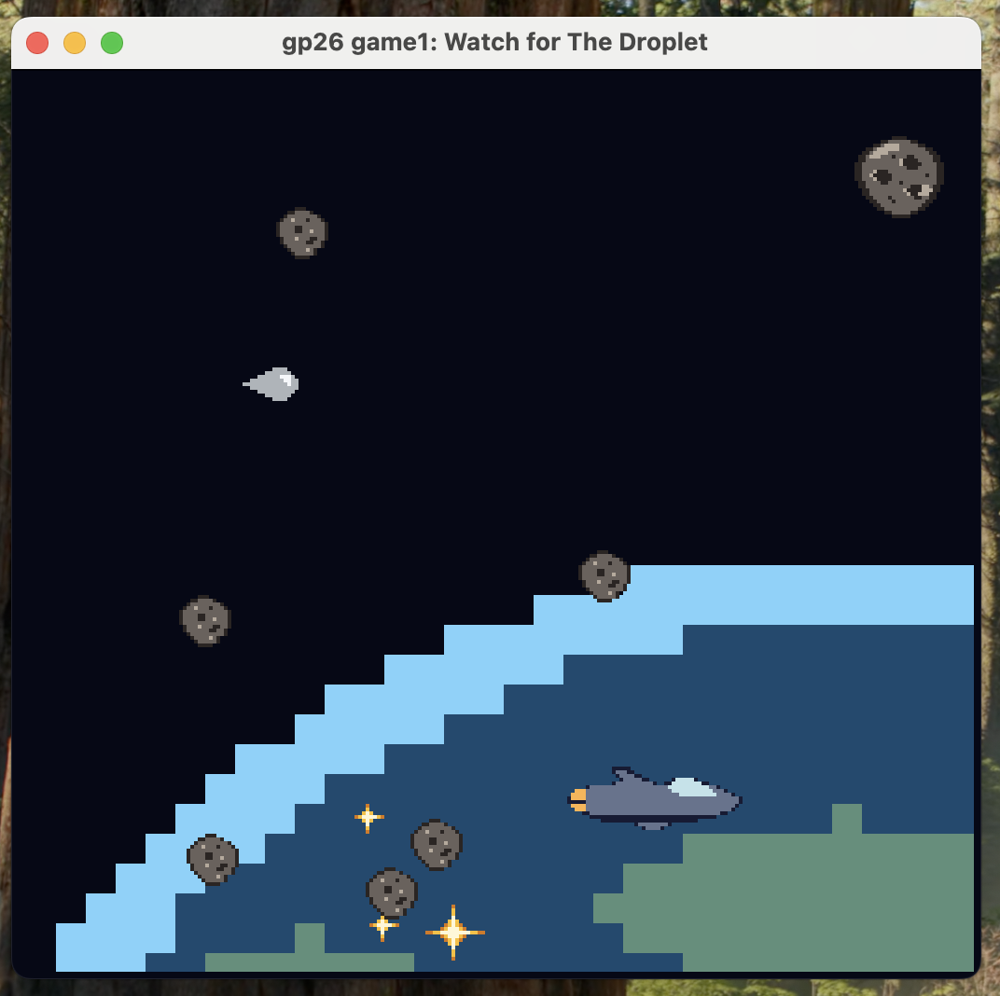
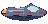
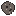
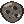
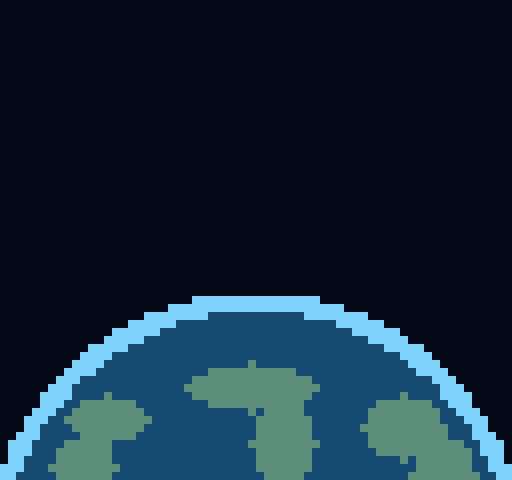
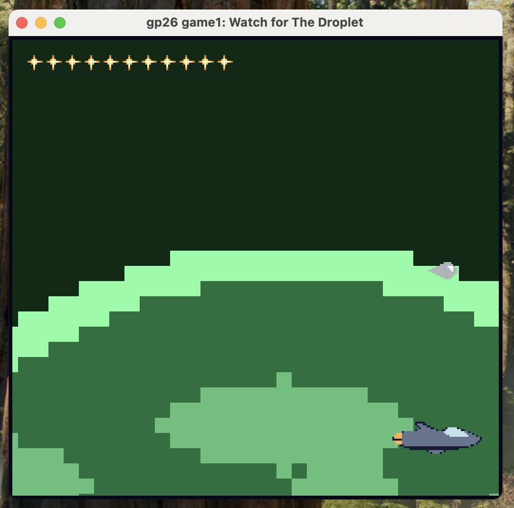
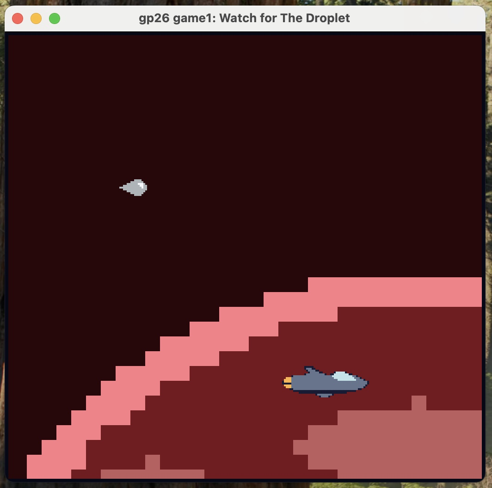

# Watch for The Droplet

- **Author**: Yuchen Zhou
- **Description**: Imagine you are a droplet. But wait, not a normal droplet in the sink, but a invincible droplet-shaped alien spacecraft in the great universe and it is ready to hunt human ships! Try your best to catch the escaping troops and something lying in the universe may help you. Try to catch as many as you can. **LET'S HUNT!**

# Asset Pipeline
## Assets
Here are all the assets I draw with Asprite:
1. [Droplet (player)](assets/droplet-16-16.png) - 
2. [Spacecraft (target)](assets/human-spacecraft-48-24.png) - 
3. Buffs: [small star](assets/small-star-8-8.png) and [bright starts](assets/bright-star-16-16.png) -  
4. Debuffs: [small meteorites](assets/meteorite-small-16-16.png) and [large meteorites](assets/meteorite-large-24-24.png) -  
5. [Background](assets/background-512-480.png) - 

## How it works
I draw every asset in Aseprite, a multiple of 8x8 and using at most 4 colours per 8x8 block, since that is all the PPU466 can store in one tile. At build time [`extract_sprite.cpp`](extract_sprite.cpp) loads each PNG with `load_png()`, slices it into 8x8 blocks, matches every pixel against a hand-chosen table of six 4-colour palettes, and packs the resulting 2-bit colour indices into the `bit0`/`bit1` bitplanes of a `PPU466::Tile`. It writes all of that to a generated [`asset.hpp`](asset.hpp) as hardcoded C++ constants: the tile data, the palette table, each asset's base slot in the 256-entry tile table, and a background map, which actually use only 4 tiles. `PlayMode` then only has to `#include "asset.hpp"` and copy those arrays into `ppu.tile_table` / `ppu.palette_table` / `ppu.background` at startup. The whole step is wired into [`Maekfile.js`](Maekfile.js), so editing a PNG regenerates `asset.hpp` and rebuilds the game automatically. `node Maekfile.js :assets` runs just the pipeline.

# How To Play:

1. You are The Droplet! Press **keyborad on up/down/left/right** to move your position and try to catch the human spacecrafts.
2. Along the way, there are many **stars** you can catch, they are the ways to boost up your speed so that you could catch those ships! They are critical.
3. Be careful! There are **meteroites** in the universe as well. They can slow down you speed. But don't be worried, you are invincible, those can not harm you a scratch.
4. Those humans are cunning! And they have a entire fleet, you have **60 seconds** to catch as many as you can. You could see how many did you catch in the end. But if you catch nothing, you will lose. **Don't lose to those Puny Humans!**

6. Wanna be the INVINCIBLE Droplet again after 60 seconds? Just press **"R"** and restart! **You are humanity's endless nightmare!**

## Other Sprites:
1. Stars: 
-  can boost you speed one step from Normal -> Accelerated -> Lightspeed.
-  can boost you directly to Lightspeed, not matter whatever the current speed you are. 
- You can not go beyond Lightspeed, that's the maximum buff you can get.
- The above logic does not apply to spacecraft, it can only be boosted from Normal -> Accelerated.
2. Meteorites:
-  will slow down your speed one step back: Lightspeed -> Accelerated -> Normal.
-  will slow down your speed two steps directly back to Normal. 
- If you are in Normal speed and you hit a meteorite (small or large), it will not effect your speed. 
- The above logic applies to the spacecraft as well.

# Acknowledgements
This game is inspired by [Three Body Problem II - The Dark Forest](https://www.3body.com/) from [Cixin Liu](https://en.wikipedia.org/wiki/Liu_Cixin).

This game was built with [NEST](NEST.md).
