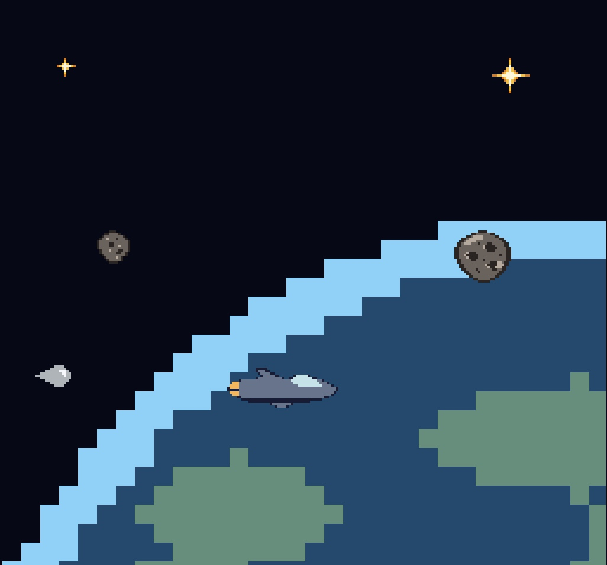

# Watch for The Droplet

- **Author**: Yuchen Zhou
- **Description**: Imagine you are a droplet. But wait, not a normal droplet in the sink, but a invincible droplet-shaped alien spacecraft in the great universe and it is ready to hunt human ships! Try your best to catch the escaping troops and something lying in the universe may help you. LET'S HUNT!

# Asset Pipeline

(TODO: describe the steps in your asset pipeline, from source files to tiles/backgrounds/whatever you upload to the PPU466.)

(TODO: make sure the source files you drew are included. You can [link](your/file.png) to them to be a bit fancier.)

# How To Play:

(TODO: describe the controls and (if needed) goals/strategy.)

## Other Sprites:
1. Stars: 
- Small stars can boost you speed one step from Normal -> Accelerated -> Lightspeed.

[small star](assets/small-star-8-8.png)

- Bright stars can boost you directly to Lightspeed, not matter whatever the current speed you are. 

[bright star](assets/bright-star-16-16.png)

- You can not go beyond Lightspeed, that's the maximum buff you can get.
- The above logic applies to the spacecraft as well.
2. Meteorites:
- Small meteorite will slow down your speed one step back: Lightspeed -> Accelerated -> Normal.
  
[small meteorite](assets/meteorite-small-16-16.png)

- Large meteorite will slow down your speed two steps directly back to Normal. 
  
[large meteorite](assets/meteorite-large-24-24.png)

- If you are in Normal speed and you hit a meteorite (small or large), it will not effect your speed. 
- The above logic applies to the spacecraft as well.

# Acknowledgements
This game is inspired by [Three Body Problem II - The Dark Forest](https://www.3body.com/) from [Cixin Liu](https://en.wikipedia.org/wiki/Liu_Cixin).

This game was built with [NEST](NEST.md).
